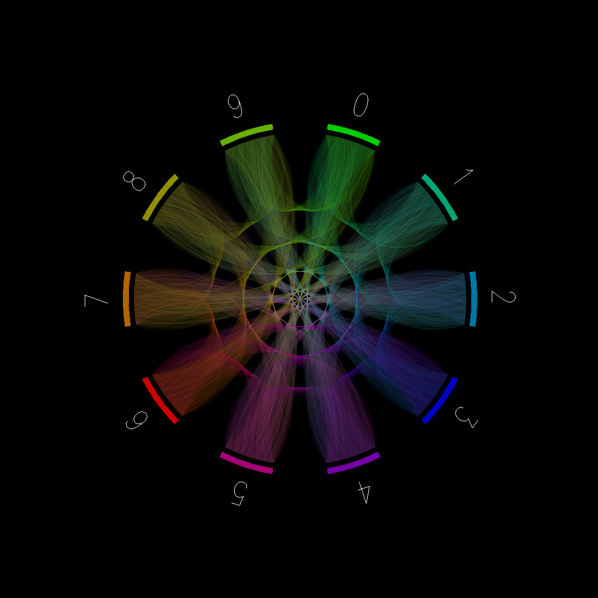
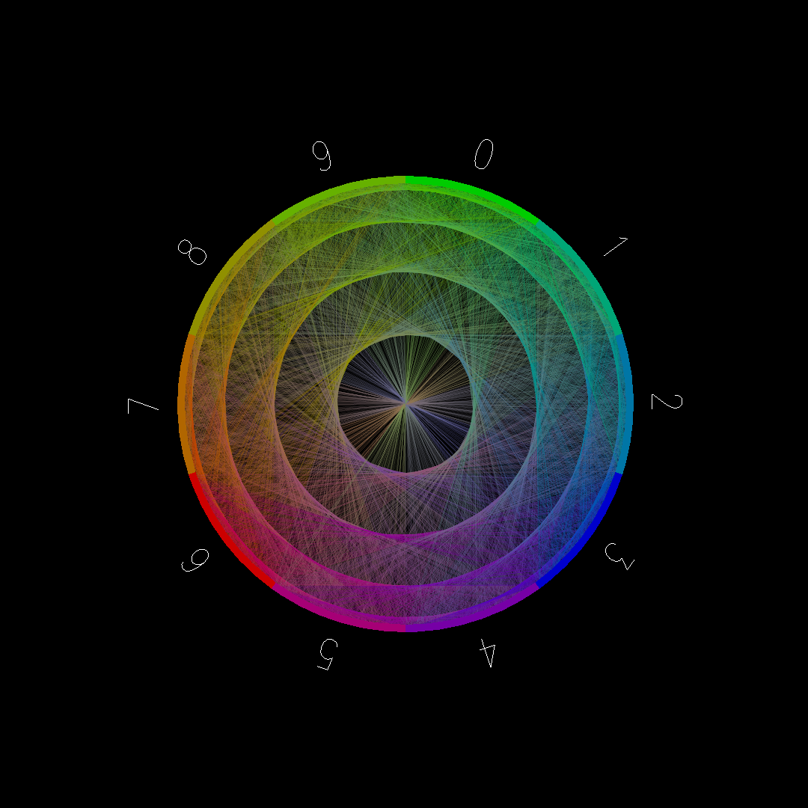
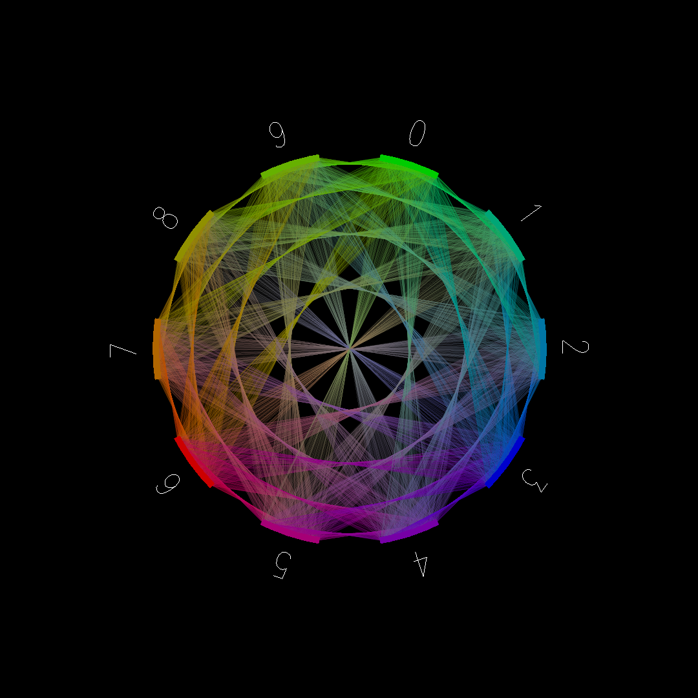
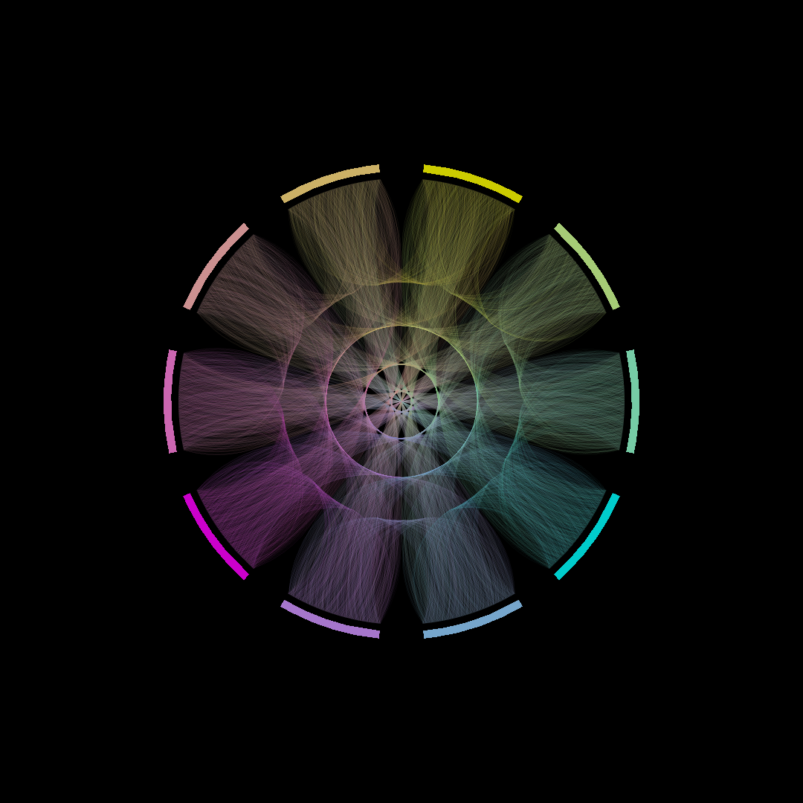
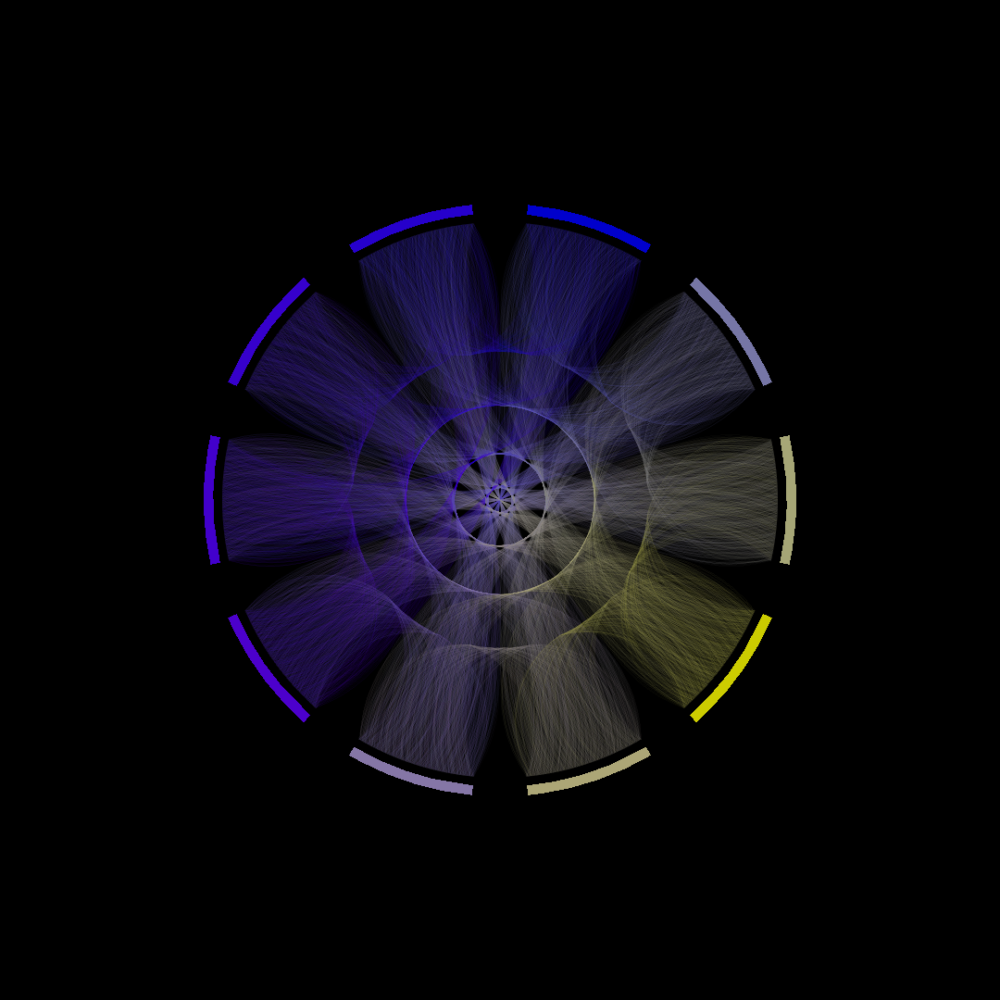
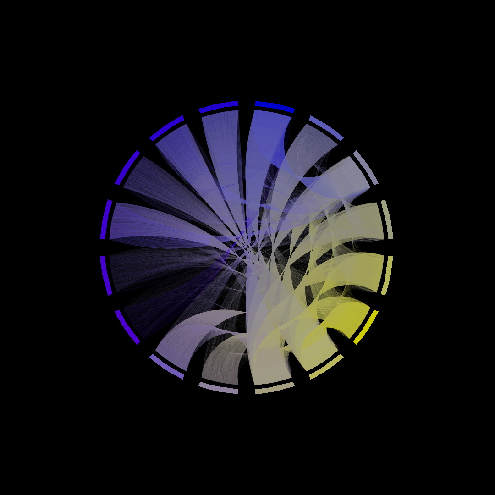
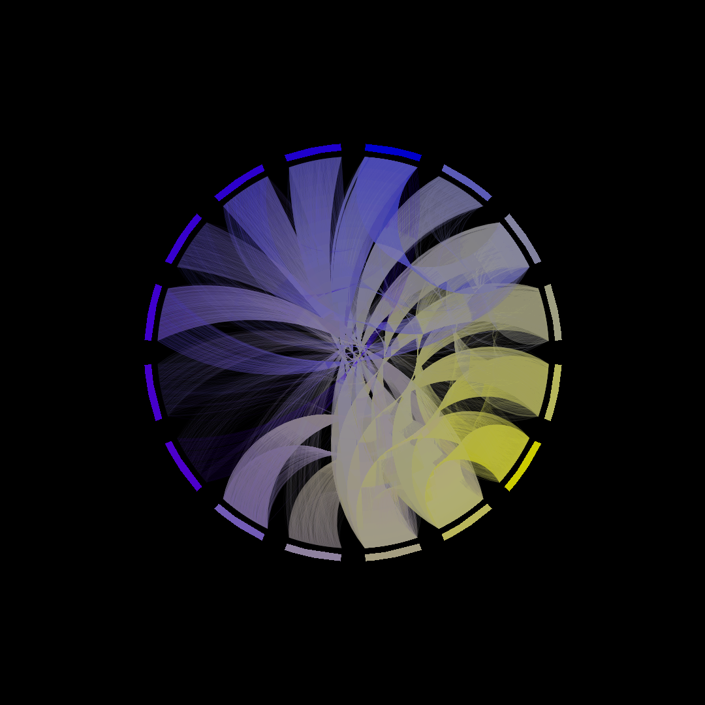
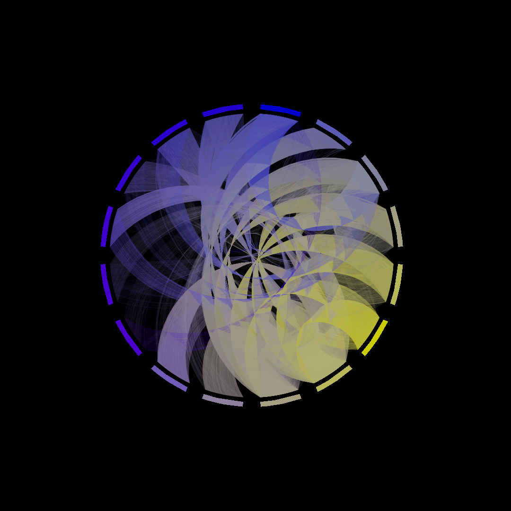
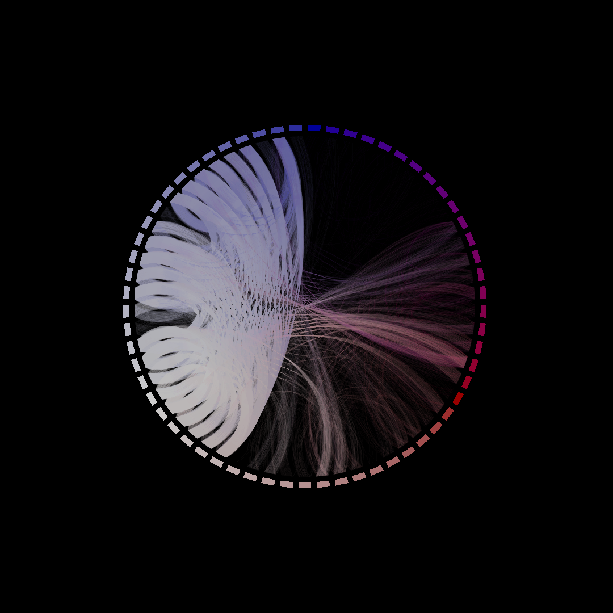

# String Visualizer

A program that let's you visualize the transitions between alphanumerical characters in any given string. My entry to the INF1 FP competition at the University of Edinburgh and a good practice project to get used to Haskell.

## Usage

There are no precompiled releases because the program is configured by changing `src/Config.hs` and recompiling. 
Therefore you will have to compile the program yourself.

### Latest cabal version

You need to have a current version (one that provides the `v2-*` commands) of `cabal-install` installed on your machine, e.g. the current [ArchLinux package](https://www.archlinux.org/packages/?name=cabal-install). If your system does not yet support this, have a look at the next section.

Then you can do:
```
$ cabal v2-run <repo-directory> <your-input-file>
```
Don't worry, this may take a while.

### Older cabal versions

If your system does not yet support the newer versions of `cabal-install` (the ones that do not provide the `v2-*` commands), you have to resolve the dependencies manually. I've tested this on my schools Scientific Linux machines with success.

You can get a binary from [the official download page](https://www.haskell.org/cabal/download.html).

The dependencies are:
```
base >= 4.8 && < 4.13
sort == 1.0.*
gloss == 1.13.*
```

Just install them by running
```
$ cabal update && cabal install base-4.8 sort-1.0 gloss-1.13
```

Now you can do
```
$ cabal run <input-file>
```
in the package directory.

## Demos

I have included some interesting files to play with this program. They are located in the `demo` directory.

`e_1000.txt` contains the first 1000 digits of Euler's number in plain text.
`pi_1000.txt` and `pi_10000.txt` contain the first 1000 / 10000 digits of Pi in plain text.
`gutenberg1.txt` contains an arbitrary book from [gutenberg.org](https://gutenberg.org).
`hex.txt` contains the hex-representation of the [Wikipedia article about trees](https://en.wikipedia.org/wiki/Tree).

To use them `cd` into the directory and run
```
$ cabal v2-run . demo/<file>
```
or
```
$ cabal run demo/<file>
```
respectively.

## Application

What is this program good for? 
Basically nothing. 
That is not to say that it doesn't do anything but for everything it does there's a better option available.

What does it do then?
It takes an arbitrary input file (plaintext), reads it's content, extracts all the alphanumerical characters and then draws a diagram where each segment of a circle corresponds to a given character and each line between segments A and B means the character B appeared directly after A in the input.

This visualization is not perfect. Especially if you try to present big inputs (to do that you need to remove the input limit by setting `doLimitInputLength` to `False`) it will be hard to see individual lines.

Additionally it's not very faster either. Because Gloss does not have a built-in function to either draw gradients or native curves, both had to be achieved by drawing many short, straight and single-coloured lines. 
This is very expensive when it comes to rendering the image, though.

## Configuration

There are many options for configuring this program available. 
Some are very straight forward, others are abstract numerical values.
The defaults should be very sane and make the program easy to use.

I suggest you play around with the values a little and see what happens.
If you screw something up badly, come back and look at the defaults.

## Possible Improvements

The biggest one here is the **curve algorithm**. At the moment it uses some circly lines which are the result of a simple algorithm and some parameters.
What I would actually like to do though is use proper parabolas to make everything, especially the edge cases, smoother. You can already find some fragments of that in the code but I haven't gotten around to implementing it properly, yet.

Another big improvement would be a **configuration parser**. This would allow me to publish precompiled releases which would still be as functional. Additionally this would mean that running the program would be faster because we can get rid of the compile times.

The third important improvement has only to do with performance. The program in its current state is very slow and needs some serious **optimization**. Since I haven't payed a lot of attention to this yet at all, there's probably a lot of room for improvement as well.

## License

As you can see, this program is licensed under GPL3.

I invite you to make whatever changes you like and share them with the world as long as you mention me and re-publish your code as free and open-source software.

## Examples













